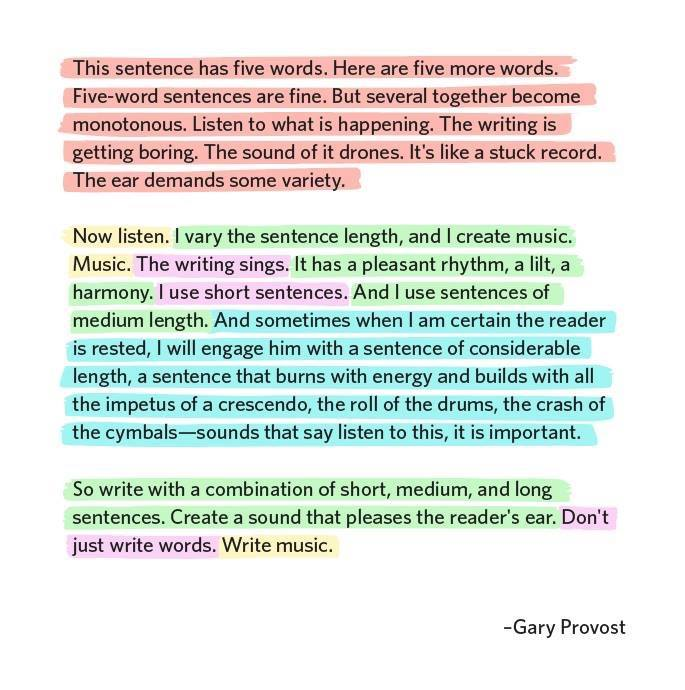

Visualising Male and Female Representation in Text
================
Cara Thompson

## Welcome!

This is the Github Repo for my [Text Sings Shiny
app](https://cararthompson.shinyapps.io/VisualisingMFRepresentation/).
It’s here to make the code available to others, as well as to help keep
track of issues, bug reports and feature requests.

## What does the app do?

This app is based on the following writing advice by Gary Provost.

The app takes a text input and highlights the sentences according to
their length. The aim is to help those writing texts quickly see whether
or not the length of their sentences varies in a way that makes the text
“sing”. Any edits users make to their text are reflected in the output,
providing users with immediate feedback.

## Can we see a demo?

<!-- Sure! -->
<!--  -->

## What resources did you use to create it?

-   [Text Mining with R: A Tidy Approach - Julia Silge & David
    Robertson](https://www.tidytextmining.com/index.html)
-   Categories S2.1 and S2.2 from [the USAS system - Paul
    Rayson](http://ucrel-api.lancaster.ac.uk/usas/tagger.html)
-   The [NRC
    Lexicon](https://onlinelibrary.wiley.com/doi/abs/10.1111/j.1467-8640.2012.00460.x)
-   The [AFINN Lexicon](https://arxiv.org/abs/1103.2903)

## Can I use it?

Of course! [Give it a
go](https://cararthompson.shinyapps.io/VisualisingMFRepresentation/) and
[let me know how I can improve
it](https://github.com/cararthompson/VisualisingMFRepresentation/issues)!

If you find the app useful for your own purposes, please share it with
others!
