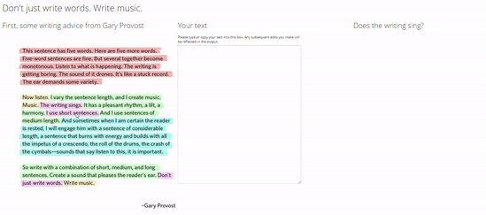

Don’t just write words. Write music.
================

## Welcome!

This is the Github Repo for my [Text Sings Shiny
app](https://cararthompson.shinyapps.io/TextSings/). It’s here to make
the code available to others, as well as to help keep track of issues,
bug reports and feature requests.

## What does the app do?

This app is based on the following writing advice by Gary Provost.

The app takes a text input and highlights the sentences according to
their length. The aim is to help those writing texts quickly see whether
or not the length of their sentences varies in a way that makes the text
“sing”. Any edits users make to their text are reflected in the output,
providing immediate feedback.

## Can we see a demo?

Sure!

## What resources did you use to create it?

-   The colours are from [Paul Tol’s Light
    palette](https://personal.sron.nl/~pault/#sec:qualitative)

## Can I use it?

Of course! [Give it a go](https://cararthompson.shinyapps.io/TextSings)
and [let me know how I can improve
it](https://github.com/cararthompson/TextSings/issues)!

If you find the app useful, please share it with others!
